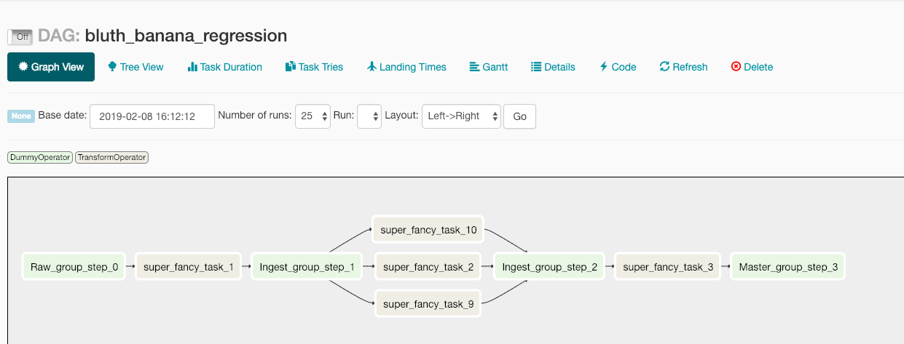

# Dev Guide

## Running Scripts

This project uses the idea of having basic (mostly) scripts to do tasks like testing, building, and serving applications - this idea was taken from https://github.com/github/scripts-to-rule-them-all. These scripts live in the /script directory and MUST be executed from the base directory of this repository.

## Getting Started

### Developing in Docker
We develop in a docker-compose orchestrated environment. We work in containers, we deploy to containers. To get started with CORE:
1. clone the repo
2. `cd` into the repo root (`/core` in most cases)
3. start your development environment with the `script/dev_env` command. This will create all the containers, network them, start all the services, and give you a shell prompt into the container of your choosing. 

*note*: `script/dev_env` will not build new images unless you use the `--build` flag. This makes testing fast, but can mean using stale docker. Buyer beware.

**Select a container shell with flags**
`--flask` gives you the flask api container
`--gui` gives you the gui container
`--notebook` gives you the notebook container (this is also the default workspace if no flag is set)

example: 

    ## I want to work in the react container
    cd /home/user/repos/core
    script/dev_env --gui
    
    ## core starts all the containers and.... 
    $core: ## prompt from _inside_ the container


_the containers_:
- `gui` container serves the react gui on `localhost:3000`
- `notebook` container serves the jupyter notebooks at `localhost:8081`
- `airflow` container serves the airflow scheduler at `localhost:8080`
- `airflow_pg` container serves the airflow database (not exposed)
- `configurationpg` container serves the configuration application postgres database (not exposed)
- `flask_api` container serves the flask api

_important notes_:
- when `docker-compose.yml` or any of the files in `dockerfiles/` are updated, you will need to run the `--build` flag to create a new base image. Example:
 
    ## I want new containers built from the updated docker files
    cd /home/user/repos/core
    script/dev_env --build
    
    ### probably 5-10 min later 'cus building images is expensive
    $core: ## prompt from inside the container
- if you suddenly get weird errors (usually sqlalchemy related) for no reason when building, your docker may be out of memory from all the stale images. Clean it up!
To do so run `docker images prune` 
- python testing can be done with coverage and debugging using the `script/test` bash script from _inside_ any of the shells. This will run the py.test suite. for debugging add the `--log` flag. For line numbers of uncovered code add the `--line` flag.   

### AWS Credentials and Accounts
There are two AWS accounts here at Integrichain, one is `sandbox` and the other is `main`. Basically, `sandbox` is dev and `main` houses both `prod` and `uat`. You should have 2 separate sets of AWS Access key pairs, but only have 1 key pair in the `credentials` file at a time. If you want to switch accounts, just copy the appropriate credentials file over `credentials`.

Layout of `~/.aws` directory:

```
~/.aws
├── config
├── credentials
├── credentials.sandbox
└── credentials.main
```

Contents of `credentials`:

```
[default]
aws_access_key_id = *******************
aws_secret_access_key = **************************************
```


### Configurations 
**Why?** 
All pipelines need configurations. These range from the name of the client to the order of transformations to be applied. 
We manage these configurations via a configuration application, which in turn stores them in an RDMBS. 


To acces these configurations you use the [Configurations module](../core/models/configuration.py)

You use [SQLAlchemy Sessions](https://docs.sqlalchemy.org/en/rel_1_2/orm/tutorial.html#querying) to query that class.

~~In development it can be useful to get the functionality without setting up and migrating a database, so we have a helper class that builds an in-memory sqlite instance and can populate mock data.~~

**UPDATED:** We now have the `SessionHelper` class. Just create an instance of SessionHelper and use that session - it handles environment configs and automatically mocks for dev environments. 


If you do still need to make configuration mock manually, here's how:
    # using configurations
    from core.helpers.configuration_mocker import ConfigurationMocker as CMock
    import core.models.configuration as config
    
    ## creates the mock db
    mock = CMock()
    session = mock.get_session()

    ## uses the config entity classes
    transform_template = config.TransformationTemplate

    ## you can seed the db
    mock.generate_mocks()
    
    total = session.query(transform_template).count()
    print(total)
    ## 2

    ## you can also add entities as you need them
    session.add(transform_template(name='great_new_transform_template'))
    session.commit()

    added = session.query(transform_template).order_by(transform_template.id.desc()).first()
    print(added.name)
    ## 'great_new_transform_template'

    new_total = session.query(transform_template).count()
    print(total)
    ## 3

However, this is _not_ the same thing as the production database environment - Sqlite does not support our PL Postgres functions, triggers etc. To get this full functionality in development you have 2 options:
- point to a Development / UAT / Production configuration\_application instance:
When you are making no changes to the config schema and just need to read, you can do this using the Secret module.

- point to a local PG instance and run the migration suite:
this will give you a full local build that you can then modify, create new migrations for etc. 

### Migrations
we use [alembic](https://pypi.org/project/alembic/) to manage migrations for the configuration application. This assumes you have:
- a running PG instance at localhost:5432 
- a database configuration\_application 
- a pg user configurator with password configurator, who owns this database and the PUBLIC schema 

Basic use is:
    
    ## apply all migrations and bring DB up to speed
    >>>MAC: database YOU$ alembic upgrade head

    ## generate a blank migration for PL stuff
    >>>MAC: database YOU$ alembic revision -m "added default trigger"  
 
    ## auto-generate a completed DDL migration based on the diff between your model and the DB
    >>>MAC: database YOU$ alembic revision --autogenerate -m "added table hamburger_salad"

### Credentials
login creds, host URLS, and other security-minded bits are managed by aws secretsmanager. To access these you can use the `Secret` class. 

    from core.secret import Secret
    s = Secret( name='hamburger',
                type_of='FTP',
                env='dev',
                mode='read')
    s.password
    ## returns hamburger_password 

Note that env should be passed from some environment-aware variable.    


## Pipeline Runs: an Airflow Story

### DAG basics
We use airflow to orchestrate our pipeline runs. The structure is only a single step hierarchy, with *Pipeline* == *DAG* and *Transformation* == *Task*. We do not use subdags. 
To keep things logically simple we do not manifest the pipeline state (raw, ingest etc) in the hierarchy; however we respect the grouping of tasks by those states, ie raw tasks will always run before ingest tasks etc. 
This is how we manage the transform DAG within a pipeline: 



Dags (and tasks) are generated _dynamically_ based on the records in the configuration application. A single set of files [dag\_builder.py](../core/airflow/dagbuilder/dag_builder.py) and [task\_orchestrator.py](../core/airflow/task_orchestrator.py) are all the mechanics of this process, and they feed into [executor.py](../core/airflow/dags/executor.py) which simply exposes the generated DAGs to airflow in scope. 

### Spacers
To avoid adding sub-dags or structuring DAG chains from state to state, we use a grouping method for tasks that relies on **spacers**. By mathematical definition a DAG progresses to a singular outcome - which means multiple bi-directional dependencies on the same task break the DAG. To implement stepped dependencies, spacers allow for multiple sources to act as upstream deps for a single downstream target, which in turn acts as the upstream dep for multiple downstream targets. in the diagram above you can see each point where the DAG compresses to a single task, like the narrow point of a sideways hourglass. These single spacer tasks do not actually run any code (use the DummyOperator) but act to orchestrate the overall DAG flow.  


### Testing Operators
tasks are instances of operators. To test operators, use the [operator\_tester.py](../core/airflow/dags/operator_tester.py) dag - this will create a simple DAG for your operator that can be run manually from the airflow GUI. 

## Over the Wire: Creating, Running and Managing Worker Containers via AWS Batch

### Philosophy


Our pipeline workflow is divided into 2 very distict roles: the orchestrator and the worker. 

**Orchestrators** control the timing and dependencies between tasks. If our pipeline is the [Philadelphia Orchestra](https://www.philorch.org/#/), the orchestrator would be the conductor.


<sup>The orchestrator component of the pipeline acts as the conductor,  
directing the workers and keeping them in time.</sup>

**Workers** do the actual data processing. These would be the tuba players and the violinists and such. Each worker is independent - so just like a single triangle player could call in sick and be replaced by her/his understudy, workers are readily replacable. 

Continuing our orchestra example, you would never want the conductor and the triangle player to be the same person; in this case, "people" represent containers. You could hypothetically have the same person play the triangle and the wood block, but never ever should the conductor be playing an instrument. For now, we spin up a new "person" (container) for each instrument (task) to be performed. 

### How it Comes Together
Our airflow Orchestrator instance creates DAGs as collections of tasks; each task is just the set of commands to be sent to AWS Batch, where a Worker instance is created and executed for each task. The same codebase lives on both the Orchestrator and Worker containers; the difference is in what code is executed in the different containers. On the Orchestrator we run the airflow code to create the scheduler, task management etc etc. On the Worker containers we execute tasks via Corebot. 


### TransformOperator and Docker.py
The transform operator is our key to communication between the "orchestrator" and the "workers"; this operator uses the [docker.py](../core/helpers/docker.py) library to:
- select the correct image in Batch
- select the job queue (we only use "core" for now)
- insert the overrides into the corebot cli string

These commands are sent to a worker instance where corebot is run! 

### Corebot
Corebot is another CLI interface. This is meant to be the "worker" part to our "orchestrator" part, allowing a separate interface for what people should be calling vs. what processes should be calling. This should only be the entry point, with the guts of the processes still living in a component in standard core.


